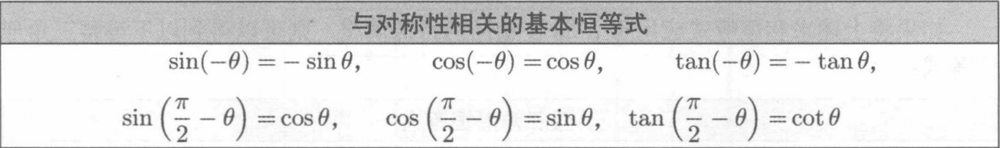

# 第1章 笛卡尔坐标系
所谓“3D数学”就是以数学方式精确地测量在三维空间中的位置、距离和角度。使用计算机执行此类计算的最常用的框架成为笛卡尔坐标系。

## 1.1 一维数学

## 1.2 二维笛卡尔空间

### 1.2.2 任意空间坐标空间
1. 每个笛卡尔坐标空间都有一个特殊的位置，称为原点（Origin），他是坐标系的“中心”。
2. 每个二维笛卡尔坐标系空间都有两条直线通过原点。每条线都被称为轴（Axis），并且可以在两个相反的方向上无限延伸。

所有二维坐标系在某种意义上都是“相等的”。

### 1.2.3 使用笛卡尔坐标指定二维中的位置
坐标空间适用于精确指定位置的框架。

## 1.3 三维笛卡尔空间

### 1.3.1 新增维度和轴
一般来说，我们会进行设置使所有轴相互垂直，即每个轴垂直于其他轴。

### 1.3.2 在三维中指定位置
在三维中，使用3个数字x、y和z指定点，这些数字分别给出yz、xz和xy平面的有符号距离。

### 1.3.3 左手与右手坐标系

假设在空间中有一条直线，需要围绕这条直线旋转指定的角度，我们将此线称为旋转轴（Axis of Rotation），旋转轴可以任意取向。
在左手坐标系中，告知哪一个方向是旋转正方向的，哪一个是旋转负方向的标砖方法称为左手规则（Left-Hand Rule），工作方式：将左手摆出一个竖起大拇指的位置，拇指指向旋转轴的正值端。右手坐标空间也有相应的规则。

任何左手坐标系可以转换为右手坐标系，反之亦然，最简单的方法是交换一个轴的正负端，另一种方法时交换两个轴。左手和右手坐标系都是完全有效的，在许多情况下，它只是z坐标中是否添加负号的问题。

### 本书中使用的一些重要约定
本书使用左手坐标系。

## 1.4 一些零散的基础知识介绍

### 1.4.1 求和和求积的表示法

求和符号也称为西格玛符号。

### 1.4.2 区间符号
[a, b]解读为“所有满足a≤x≤b的数字x”，这是一个闭区间（Closed Interval），意味着端点a和b也包含在区间中；开区间（Open Interval）则是排除端点的区间，即(a, b)。偶尔也会遇到半开（Half-open）区间，比如[a, b)。
如果某个端点是无限的，则可以认为概端点是开放的，比如[0, ∞]。

### 1.4.3 角度、度数和弧度
角度可以测量平面中的旋转量。表示角度的变量通常被赋予希腊字母θ。用于指定角度的最重要的度量单位是度（°）和弧度（rad）。
人类通常使用度（Degree）数来测量角度。一度表示旋转1/360.数学家更喜欢以弧度（Radian）为单位测量角度，弧度是基于圆的属性的度量单位。

### 1.4.4 三角函数

### 1.4.5 三角函数的恒等式

