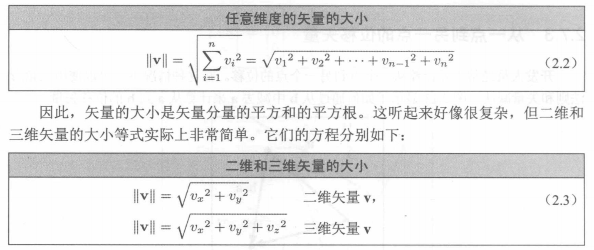

# 第2章 适量
矢量（Vector）是用于构建2D和3D数学的正式数学单位。

## 2.1 向量和其他无聊东西的数学定义
数学家辉区分向量和标量（Scalar）数量。标量其实就是普通数学的技术术语。速度（Velocity）和位移（Displacement）都是向量，而速率（Speed）和距离（Distance）则是标量。

向量的维度（Dimension）表示包含的向量的数量。向量可以是任何正维度，包括一个。水平写入的向量称为行向量（Row Vector），垂直写入的向量称为列向量（Column Vector）。

当希望引用向量中的各个分量（Components）时，可以使用下标（Subscript）表示法。

## 2.2 矢量的几何定义
从几何学上讲，向量（现在应该叫“矢量”）是具有大小（Magnitude）和方向（Direction）的有向线段。矢量没有位置。

位移（Displacement）和速度（Velocity）在技术上与术语距离（Distance）和速率（Speed）不同。距离标量是位移矢量的量值，速率标量是速度矢量的量值。

## 2.3 使用笛卡尔坐标指定矢量
当使用笛卡尔坐标来描述矢量时，每个坐标将度量相应维度中的有符号位移（Signed Displacement）。

### 2.3.1 作为位移序列的矢量
考虑通过矢量描述位移的一种有用方法是将矢量分解为其按轴向对齐的分量。当这些轴向对齐的位移组合在一起时，他们即可以累加方式定义由矢量（作为一个整体）定义的位移。  

### 2.3.2 零矢量
对于任何给定的矢量维度，都有一个特殊的矢量，称为零矢量（Zero Vector），即在每个位置都有零值。零矢量可以看作是表达“无位移”概念的一种方式，就像标量零代表“无数量”的概念一样。

## 2.4 矢量与点
概念上，“点”指的是位置，而“矢量”指定的是位移。

### 2.4.1 相对位置
矢量可以描述位移，所以它们可以描述相对位置。某物体的位置通过描述它与其他物体的已知位置之间的关系来指定。
从理论上讲，我们可以建立一个包含现存一切的参考框架，并选择一个点作为该空间的“原点”。

### 2.4.2 点与矢量之间的关系
点也是相对的，它们是相对于用于指定其坐标的坐标系的原点。

### 2.4.3 一切都是相对的

## 2.5 负矢量

### 2.5.1 正式线性代数规则
为了让任何维度的矢量变负，可以简单地让矢量的每个分量变负。

### 2.5.2 几何解释
使矢量变负会产生大小相同但方向相反的矢量。

## 2.6 标量和矢量的乘法
将矢量乘以标量，结果是一个与原始矢量平行的矢量，但具有不同的长度和可能相反的方向。

### 2.6.1 正式线性代数规则
计算矢量与标量相乘的乘法很简单，只要简单地用标量乘以矢量的每个分量即可。

标量无法乘以矢量，矢量也无法除以另一个矢量。

### 2.6.2 几何解释
在几何上，将矢量乘以标量k具有将长度缩放|k|因子的效果。

## 2.7 矢量的加法和减法
我们可以将两个矢量相加或相减，只要它们具有相同的维度。

### 2.7.1 正式线性代数规则
要是两个矢量相加，只要使用它们相应的分量相加即可。矢量的减法可以理解为加一个负矢量。
矢量不能和标量相加或相减，也不能和不同维度的矢量相加或相减。此外，矢量的加法是可交换的。

### 2.7.2 几何解释
如果从一个点开始应用由a指定的位移，然后再应用由b指定的位移，那就像应用了单个位移a+b一样。

### 2.7.3 从一个点到另一点的位移矢量
矢量减法b-a产生的是从a到b的矢量。简单地说，要找到“两点之间”的矢量没有任何意义，因为“两点之间”这样的描述没有指定方向。我们必须始终明确，要产生的是从一个点到另一个点的矢量。

## 2.8 矢量大小
矢量的大小也称为矢量的长度（Length）或范数（Norm）。

### 2.8.1 正式线性代数规则
在线性代数中，矢量的大小通过使用围绕矢量的双垂直线来表示。

### 2.8.2 几何解释

## 2.9 单位矢量
单位矢量（Unit Vector）是大小为1的矢量。单位矢量也称为归一化矢量（Normalized Vector）。
单位矢量有时也称为法线（Normal）。但是，当大多数人谈到“法线”矢量时，他们通常指的是垂直于某物的矢量。
总之，“归一化”适量总时具有单位长度，但“法线”矢量则是与某些东西垂直的矢量，并且按照惯例通常具有单位长度。

### 2.9.1 正式线性代数规则
对于任何非零矢量v，可以计算指向与v相同方向的单位矢量，此过程称为矢量的归一化（Normalizing）。为了归一化矢量，可以将矢量除以其大小。
零矢量无法被归一化，因为零矢量没有定义方向。

### 2.9.2 几何解释
在二维中，如果将单位矢量的尾部绘制在原点，则矢量的头部将解除到以原点为中心的单位圆（单位圆的半径为1）。在三维中，单位矢量接触到的是单位球面。

## 2.10 距离公式
首先，将距离定义为两点之间的线段长度。由于矢量时有向线段，因此几何上有意义的是，两点之间的距离将等于从一点到另一点的矢量的长度。

## 2.11 矢量点积
有两种类型的矢量乘积：第一种矢量乘积是点积（Dot Product），也称为内积（Inner Product），另一种矢量乘积是叉积。

### 2.11.1 正式线性代数规则
“点积”的名称来自矢量乘积表示法中使用的点符号：a·b。
两个矢量的点积是相应分量的乘积之和，得到的是一个标量。

矢量点积是可交换的：a·b = b·a。

### 2.11.2 几何解释
第一个几何定义，是执行投影（Projection）的点积。

假设a是一个单位矢量，b是一个任意长度的矢量。现在取b并将其投影到与a平行的线上。可以将点击a·b定义为b投影在改线上的有符号长度。点击的结果是标量而不是矢量。

当b的投影指向a的相反方向时，该值将为负，当a和b垂直时，投影具有零长度（它是个点）。换句话说，点积的符号可以给予我们对两个矢量的相对方向的粗略分类。

当缩放b时：它在a上的投影长度随着点积值的增加而增加。如果缩放a，点积的值域a的长度成比例，就像缩放b时一样。

点击a·b等于b投影到平行于a的任何线上的有符号长度，乘以a的长度。

当两个矢量a和b都是单位矢量时，可以很容易的得出a在b上的投影与b在a上的投影具有相同的长度，我们已经证明任何一个矢量的缩放将按比例地缩放点积，因此该结果适用于具有任意长度的a和b。

点积的下一个重要特性是它通过加法和减法进行分布，就像标量乘法一样.

矢量大小是一个标量，用于测量矢量的位移量（长度）。点积也测量位移量，但只计算特定方向的位移，在投影过程中会丢失垂直位移。
如果将矢量投影到自身上，则该投影的长度就是矢量的大小。a·b等于b投影到a上的长度，并且按||a||缩放。如果用矢量自身计算矢量点积，则得到的是投影的长度（即||v||）乘以投射到的矢量的长度（也是||v||）。

透过三角法的视角来检查点积。两个矢量a和b的电机等于矢量之间角度θ的余弦，乘以矢量的长度。
点积为提供了计算两个矢量之间角度的方法。

总结点积的几何属性：
1. 点击a·b将测量b投影到a上的长度，乘以a的长度。
2. 点击可用于测量特定方向的位移。
3. 投影运算与余弦函数密切相关。点击a·b也等于||a|| ||b||cosθ，其中θ是矢量之间的角度。

## 2.12 矢量叉积
另一种矢量乘积，即叉积（Corss Product），只能在三维中应用。与产生标量且可交换的点积不同，矢量叉积将产生三维矢量并且不是可交换的。

### 2.12.1 正式线性代数规则
术语“叉积”来自表达式a x b中使用的符号。
叉积与点积具有相同的运算符优先级：乘法发生在加法和减法之前。当点击和叉积一起使用时，叉积优先：a · b x c = a · (b x c)。运算a · (b x c)被称为三重积（Triple Product）。
矢量叉积是不可交换的，它是反交换的：a x b = -(b x a)。叉积也不是可结合的，(a x b) x c ≠ a x (b x c)。

### 2.12.2 几何解释
叉积将产生一个矢量，垂直于原始的两个矢量。