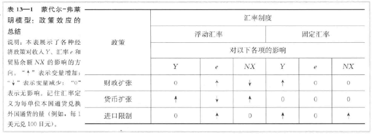

# 第13章 重访开放经济：蒙代尔-弗莱明模型与汇率制度
本章建立的模型被称为 **蒙代尔-弗莱明模型**（Mundell-Fleming model）。该模型被描述为“研究开放经济下货币政策和财政政策的主导政策范式”。

蒙代尔-弗莱明模型是IS-LM模型的近亲。这两个模型都强调了产品市场与货币市场之间的相互作用。这两个模型都假设价格水平是固定的，然后说明是什么引起总收入的短期波动（或者，等价地，是什么引起总需求曲线的移动）。它们的关键区别是，IS-LM模型假设一个封闭经济，而蒙代尔-弗莱明模型假设一个开放经济。

蒙代尔-弗莱明模型作出了一个重要而极端的假设：它假设所研究的经济是一个资本完全流动的小型开放经济。该经济的利率是由世界利率决定的。

从蒙代尔-弗莱明模型中得到的一个启示是，一个经济的行为取决于它所采用的汇率制度。

## 13.1 蒙代尔-弗莱明模型

### 关键假设：资本完全流动的小型开放经济
这个假设意味着该经济中的利率r由世界利率r*决定。数学上，可以把这个假设写为

r = r*

这个方程代表着如下假设：资本的国际流动之迅速足以使国内利率等于世界利率。

### 产品市场与IS*曲线
产品与服务市场的描述与IS-LM模型大致相同，但它新增了净出口这一项。用如下方程来表示：

Y = C（Y - T） + I（r） + G + NX（e）

这个方程是说，总收入Y是消费C、投资I、政府购买G和净出口NX之和。消费正向地取决于可支配收入Y - T。投资反向地取决于利率。净出口反向地取决于汇率e。汇率e定义为每一单位国内通货所能兑换到的外国通货量。

通过使用完全资本流动假设r=r*来简化：

Y = C（Y - T） + I（r*） + G + NX（e）

用图形表示这一方程，横轴表示收入，纵轴表示汇率。IS*曲线是从净出口曲线和凯恩斯交叉中推到出来的，该曲线向右下方倾斜，这是因为更高的汇率减少了出口，净出口的减少又降低了总收入。

### 货币市场与LM*曲线
蒙代尔-弗莱明模型用如下方程来代表货币市场：

M / P = L（r，Y）

它是说实际货币余额的供给M/P等于需求L（r，Y）。实际货币余额的需求反向地取决于利率，正向地取决于收入Y。货币供给M是由中央银行控制的外生变量，由于蒙代尔-弗莱明模型被设计用来分析短期波动，所以价格水平也被假设为外生固定的。

再次加上国内利率等于世界利率的假设，即r=r*：

M / P = L（r*，Y）

称为LM\*曲线。可以用一条垂线来表示这个方程。给定世界利率，无论汇率如何，LM\*方程决定了总收入。

### 把各部分整合在一起
根据蒙代尔-弗莱明模型，资本完全流动的小型开放经济可以用两个方程来描述：

Y = C（Y - T） + I（r*） + G + NX（e） -> IS*

M / P = L（r*，Y） -> LM*

第一个方程描述了产品市场的均衡，第二个方程描述了货币市场的均衡。外生变量是财政政策G和T、货币政策M、价格水平P以及世界利率r*。内生变量是收入Y和汇率e。

## 13.2 浮动汇率下的小型开放经济
在 **浮动汇率**（floating exchange rate）制下，汇率有市场力量决定，可以随着经济状况的变动而波动。在这种情况下，汇率e进行调整以达到产品市场与货币市场的同时均衡。当某样东西偶然改变该均衡时，汇率可以运动到新的均衡值。

### 财政政策
财政政策在小型开放经济中的影响与在封闭经济中差别很大。在封闭经济的IS-LM模型中，财政扩张提高了收入，而在浮动汇率的小型开放经济中，财政扩张使收入保持在同一水平。从机制上来说，这种差异的产生是因为LM*是垂直的，而我们用来研究封闭经济的LM曲线是向上倾斜的。

在一个小型开放经济中，只要利率上升到世界利率r\*以上，资本就迅速从国外流入以追求更高的回报，随着这一资本流入将利率推回到r\*，它还产生了另外一种效应：由于国外投资者为了投资于国内经济需要买进本币，资本流入增加了外汇市场上对本币的需求，抬高了本币价值，使国内产品相对于国外产品变得昂贵，从而降低了净出口。净出口的下降正好抵消了扩张性财政政策对收入的影响。

在封闭经济和开放经济中，实际货币余额的供给量M/P都被中央银行（确定M）和黏性价格假设（固定P）固定了。需求量（由r与Y决定）必须等于这一固定供给。在一个封闭经济中，财政扩张引起均衡利率上升。伴随着利率的上升（它减少了货币需求量），均衡收入增加（它提高了货币需求量）：这两种效应共同维持了货币市场的均衡。与此相反，在小型开放经济中，r固定在r*，因此，可以满足这个方程的收入水平只有一个；当财政政策变动时，这一收入水平保持不变。因此，当政府增加支出或减税时，通货的升值和净出口的下降必须大到足以完全抵消该政策对收入的扩张效应。

### 货币政策
假定中央银行增加了货币供给。由于价格水平被假设为固定的，货币供给的增加意味着实际货币余额的增加。实际货币余额的增加使LM*曲线向右移动。因此，货币供给的增加提高了收入，降低了汇率。

在一个封闭经济中货币供给的增加使支出增加，这是因为降低了利率并刺激了投资。

在一个小型开放经济中，一旦货币供给的增加开始给国内利率以向下的压力，由于投资者会到其他地方寻求更高的利益，所以资本从该经济流出。这种资本流出阻止了国内利率下降到世界利率r*以下。它还有另一种效应：由于投资与海外需要把本币兑换为外币，资本的流出增加了国内通货在外汇市场上的供给，引起本币贬值。这一贬值使国内产品相对于国外产品更为便宜，刺激了净出口，从而增加了总收入。因此，在一个小型开放经济中，货币政策通过改变汇率而不是利率来影响收入。

### 贸易政策
假定政府通过设置进口配额或征收关税来减少对进口产品的需求。由于净出口等于出口减去进口，所以，进口的减少意味着净出口的增加。净出口曲线向右移动。净出口曲线的这种移动增加了计划支出，从而使IS*曲线向右移动。由于LM*曲线是垂直，贸易限制提高了汇率，但不影响收入。这一转变背后的经济力量与扩张性财政政策的情况类似。

由于贸易限制并不影响收入、消费、投资或政府购买，所以它不影响贸易余额。尽管净出口曲线的移动影响与增加NX，但汇率上升有等量地减少了NX。总体效应仅仅是贸易减少了。国内经济比实行贸易限制前进口得更少了，但出口也更少了。

## 13.3 固定汇率下的小型开放经济
在 **固定汇率**（fixed exchange rates），中央银行宣布一个汇率值，并且为了将汇率保持在宣布的水平而随时准备买进和卖出本币。

### 固定汇率制度是如何运行的？
固定汇率决定了一国的货币政策只致力于唯一的目的：使汇率保持在所宣布的水平。换言之，固定汇率的实质是中央银行承诺允许货币供给调整到保证外汇市场的均衡利率等于所宣布的汇率所需的任何水平。而且，只要中央银行随时准备按固定汇率买卖外汇，货币供给就会自动地调整到必要的水平。

均衡汇率最初大于固定汇率水平。套利者将在外汇市场上购买外国通货，然后把它卖给美联储以获利。这个过程自动增加了货币供给，是LM\*曲线向右移动，降低了汇率。均衡理论最初低于固定汇率水平。套利者将从美联储购买外国通货，然后在外汇市场上出售以获利。这个过程自动减少了货币供给，使LM\*曲线向左移动，提高了汇率。

这种汇率制度固定的是名义利率。它是否也固定了实际汇率取决于所考虑的确时间范围。如果价格水平像在长期中那样是有弹性的，那么即使名义利率是固定的，实际汇率也可能变动，固定的名义汇率只影响货币供给与价格水平。然而，在蒙代尔-弗莱明模型所描述的短期中，价格是固定的，因此，固定的名义汇率也意味着固定的实际汇率。

### 财政政策
假定政府通过增加政府购买或减税刺激国内支出。这种政策使IS\*曲线向右移动，又由于中央银行随时准备按固定汇率交易外币与本币，套利者通过把外汇卖给中央银行来迅速对汇率上升作出反应，导致自动的货币扩张。货币供给的增加使LM\*曲线向右移动。因此，在固定汇率下财政扩张增加了总收入。

### 货币政策
设想实行固定汇率的中央银行力图增加货币供给，例如从公众手中购买债券。这种政策的初始影响是使LM\*曲线向右移动，这降低了汇率。但是由于中央银行承诺按固定汇率交易本币与外币，套利者通过向中央银行出售本币对汇率下降迅速做出反应，导致货币供给和LM\*曲线回到它们的 初始位置。因此，通常实施的货币政策在固定汇率下是无效的。通过实行固定汇率，中央银行放弃了它对货币供给的控制。

然而，一个采用固定汇率的国家也可以实施一类货币政策：它可以决定改变所固定的汇率水平。通货的官方价值的下降被称为 **货币贬值**（devaluation），通货的官方价值的上升被称为 **货币升值**（revaluation）。在蒙代尔-弗莱明模型中，货币贬值使LM\*曲线向右移动，其作用类似于浮动汇率下货币供给的增加。因此，货币贬值扩大了净出口，提高了总收入。相反，货币升值使LM\*曲线向左移动，减少了净出口，降低了总收入。

### 贸易政策
假定政府通过设置进口配额或征收关税来减少进口。这种政策使净出口曲线向右移动，从而使IS*曲线向右移动。IS*曲线的移动倾向于提高汇率。为了将汇率保持在固定水平，货币供给必须上升，这使得LM*曲线向右移动。

固定汇率下贸易限制的结果与浮动汇率下非常不同。在这两种情况下，贸易限制都使净出口曲线向右移动，但只有在固定汇率下，贸易限制才增加了净出口（NX）。原因是固定汇率下贸易限制引起了货币扩张而不是汇率升值。货币扩张又提高了总收入。回忆国民收入核算恒等式

NX = S - I

当收入上升时，储蓄也上升了。这意味着净出口的增加。

### 蒙代尔-弗莱明模型中的政策：总结
蒙代尔-弗莱明模型说明，几乎任何经济政策对小型开放经济的影响取决于汇率使浮动的还是固定的。

